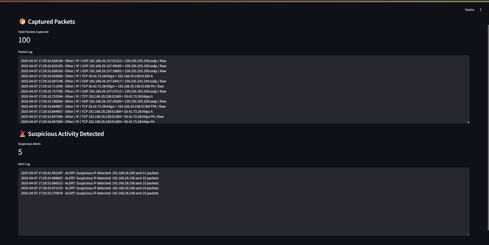

# 🔐 Network Threat Detection System

This is a real-time cybersecurity tool built using Python.  
It sniffs incoming and outgoing network packets, detects possible suspicious patterns (like DoS attacks), and logs them. It includes an interactive dashboard built with Streamlit to visualize and monitor suspicious traffic in real-time.

---

## 💡 Features

- ✅ Real-time packet sniffing using Scapy  
- ✅ Suspicious activity detection (like repeated IP requests)  
- ✅ Logging of all packets and alerts  
- ✅ Live interactive dashboard using Streamlit  
- ✅ Beginner-friendly, Built with love and logic by Aastha after completing Google Cybersecurity Certification


---

## 🛠️ Tech Stack

- **Python**
- **Scapy** – for sniffing network packets  
- **Streamlit** – for dashboard UI  
- **Log Files** – to store activity  

---

## 📂 Folder Structure

```bash
snifferproject/  
├── sniffer.py              # Basic packet sniffing script  
├── threat_sniffer.py       # Detects network threats and logs them  
├── dashboard.py            # Displays live logs on a Streamlit dashboard  
├── packets.log             # Stores sniffed packet info  
├── alerts.log              # Logs alerts for suspicious activities  
├── captured_packets.pcap   # Backup packet capture file  
└── README.md               # You're reading it now!
```

---

## 🚀 How to Run

1. **Install the required libraries**:
```bash
pip install scapy streamlit
python threat_sniffer.py
streamlit run dashboard.py
```

🖼️ Dashboard Preview


Dashboard screenshot saved as screenshot.png

---

## 👩‍💻 Created By

**Aastha Sharma**  
🎓 Google Cybersecurity Certified  
💻 B.Tech Computer Science & Design  
📍 Passionate about security, development & innovation  

---

## 🔮 Future Scope

- Add more threat detection signatures (like MITM, ARP spoofing)  
- Email/Slack alerts for real-time notification  
- Auto-block suspicious IPs (requires admin-level networking control)  

> Built with 💖, logic & Google Certification knowledge by Aastha Sharma
